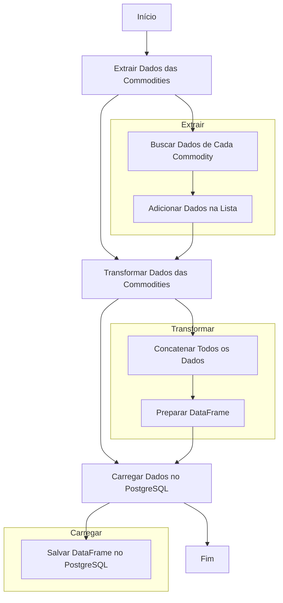

# workshop-aberto-dw-do-zero

## Projeto de Integração de Dados Financeiros e ETL

Este projeto integra dados financeiros de ações utilizando a API do Yahoo Finance (yfinance), realiza transformações (ETL) nos dados e os armazena em um banco de dados PostgreSQL utilizando Streamlit para visualização interativa.

### Funcionalidades Principais

1. **Integração de Dados Financeiros:**
   - O projeto utiliza a API yfinance para extrair informações de mercado das ações.
   - São obtidos os valores de fechamento (CL - Close), maior cotação do dia (GC - High) e menor cotação do dia (SI - Low) de ações especificadas.

2. **Transformação e Carga de Dados (ETL):**
   - Os dados obtidos são transformados para o formato adequado utilizando Python e bibliotecas como pandas.
   - Utiliza-se o Streamlit para criar uma interface de usuário que permite a visualização dos dados brutos e de análises derivadas.

3. **Armazenamento em Banco de Dados:**
   - Os dados processados são carregados em um banco de dados PostgreSQL.
   - É utilizado o pgAdmin para gerenciar e visualizar os dados armazenados no banco.

### Estrutura do Projeto

- **`main.py`**: Script principal que integra os dados da API yfinance, realiza ETL e interage com o Streamlit para visualização.
  
- **`requirements.txt`**: Arquivo contendo todas as dependências necessárias para executar o projeto.

### Instruções de Uso

1. **Configuração do Ambiente:**
   - Clone este repositório em seu ambiente local.
   - Instale as dependências necessárias listadas no arquivo `requirements.txt`.

2. **Execução do Projeto:**
   - Execute `main.py` para iniciar o aplicativo Streamlit.
   - O aplicativo irá carregar os dados financeiros, permitir visualização e interação através de gráficos e filtros.

3. **Gerenciamento do Banco de Dados:**
   - Utilize o pgAdmin para visualizar e gerenciar os dados armazenados no banco PostgreSQL.

### Contribuições e Suporte

- Contribuições são bem-vindas! Sinta-se à vontade para abrir problemas (issues) e pull requests para melhorias no código.
- Para suporte adicional, entre em contato através dos canais disponíveis neste repositório.

Este projeto visa demonstrar a integração de dados financeiros em tempo real, transformação e carga utilizando tecnologias populares e é ideal para quem deseja explorar dados de mercado de maneira eficiente e visualmente atraente.
